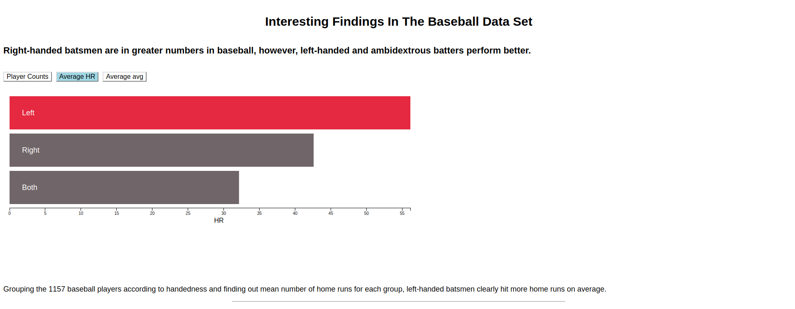

## Data Visualization
#### [Interesting Findings In The Baseball Data Set](https://bilalmahmood1.github.io/D3-Project/index_old_version.html)

  

### Summary
Right-handed batsmen are most common in the game, but left-handed batsmen hit on average more home runs and ambidextrous batters have the best batting average.

### Design

I had small set of summary numbers for different batting handedness and I wanted to compare among them. Thus the most likely choice was encoding aggregated numbers like number of players, mean home runs for each group etc., as length of a rectangle. And for the handedness categories (R,L and B), I chose position. Thus, I made an interactive  bar chart that could help compare aggregated summary for different batting handedness. In addition, I colored the handedness category with the highest summary number, like R handed batsman were  most common in the data set thus leveraging reader’s pre-attentive processing abilities.

### Feedback

##### Feedback 4: Handedness labels too small and difficult to see when things change

To make y labels more visible, I have increased the size and used complete words that would help to see change of labels.

##### Feedback 3: Too many findings

To avoid confusing the reader about too many findings, I focused on just few findings that I think are more interesting. I removed chart 2 altogether and made my findings more clear and precise.

##### Feedback 2: Overplotting of data points in Chart 2

Added little random jitter to each player's weight and height and thus reduced the overlapping problem. Didn't try varying opacity for each data point as it would be less effective in this case.*

##### Feedback 1: Tooltip missing information for the Chart 2

Modified tooltip text to show actual numbers (HR/avg) for each baseball player.Thus allowing readers to access actual values along with color encoding*

### Resources
- [Mike Bostock’s D3 scatterplot example](http://bl.ocks.org/mbostock/3887118)
- [Color for Bar chart](http://www.colorcombos.com/color-schemes/2511/ColorCombo2511.html)
- [Diverging color for scatterplot](http://colorbrewer2.org/#type=diverging&scheme=RdYlBu&n=7)
- [Scott Becker's D3 tutorials](http://synthesis.sbecker.net/articles/2012/07/08/learning-d3-part-1)
- [Make Effective Data Visualization](https://classroom.udacity.com/courses/ud507)

